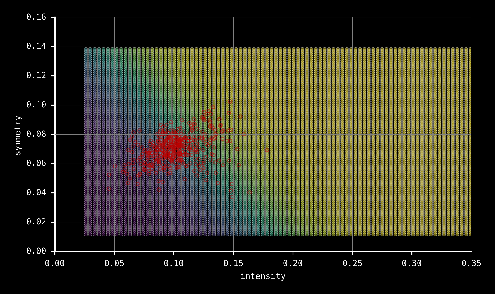
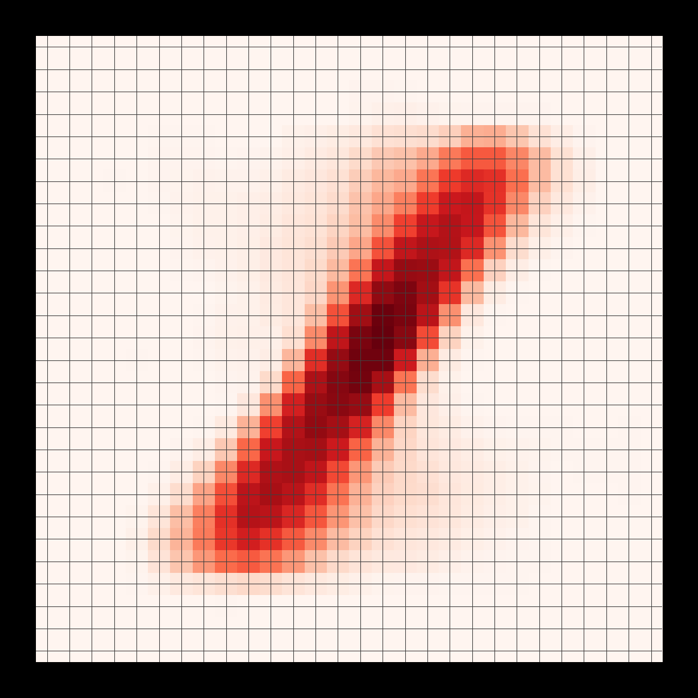
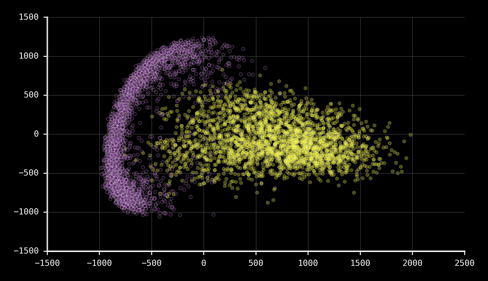
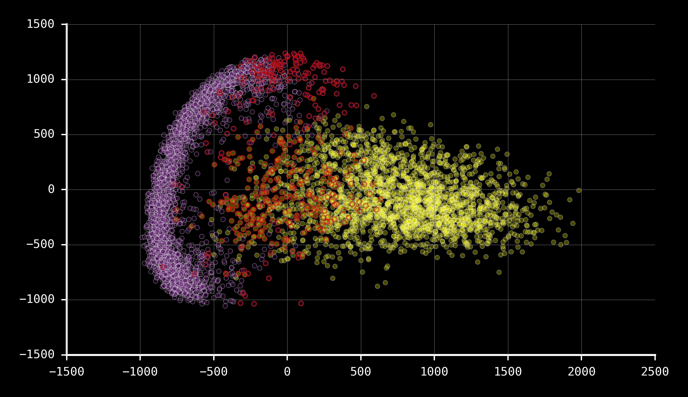
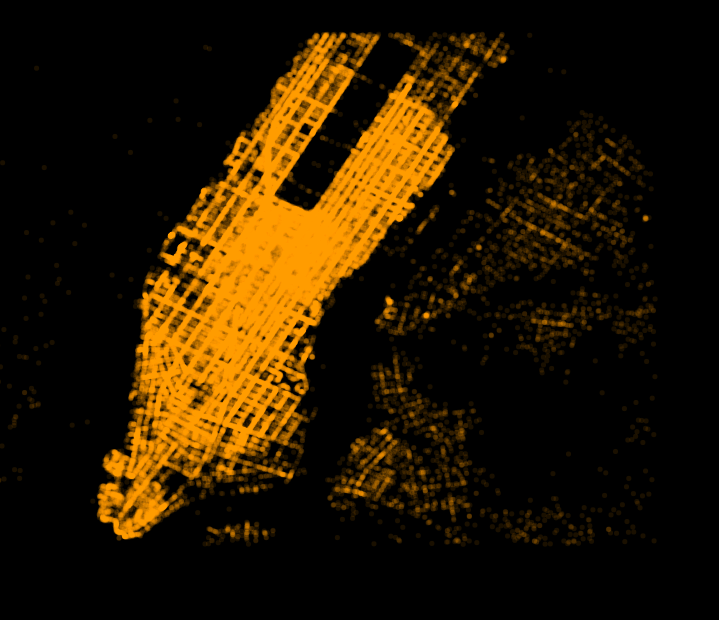
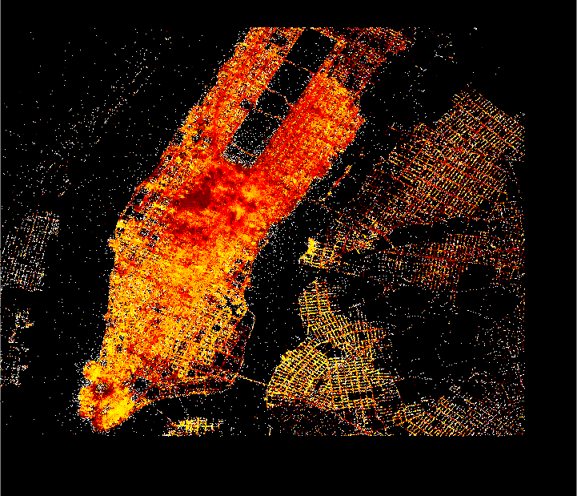
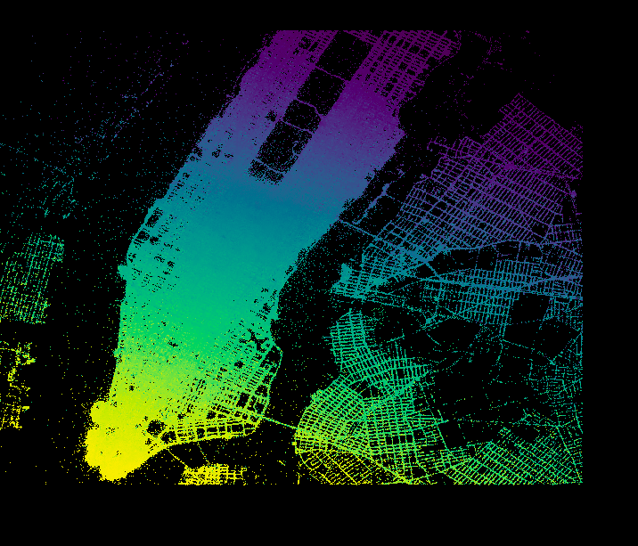
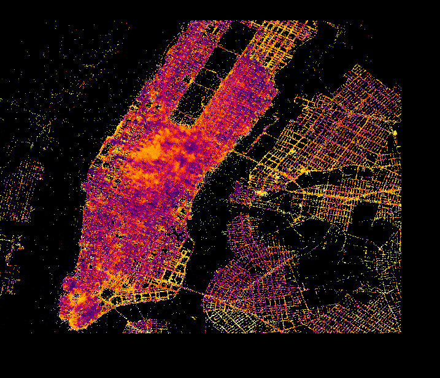

theme: Olive Green, 9

# [fit] **Visualising ML Models**
## ___
## Amit Kapoor
## @amitkaps

---

# **Story**
## ___
## “We don’t see things as they are, we see them as we are.”
### *— Anais Nin*

---

# **The Blind Men & the Elephant**
## ___
### “And so these men of Indostan
### Disputed loud and long,
### Each in his own opinion
### Exceeding stiff and strong,
### Though each was partly in the right,
### And all were in the wrong.”
#### — *John Godfrey Saxe*

---

# **The Elephant: Data**
## ___
## “Data is just a clue to the end truth”
### *— Josh Smith*

---

# **The Men: Building Models**
## ___
## "All models are wrong, but some are useful"
### *— George Box*

---

# **Ladder of Abstraction**
## ___
## **Data** Abstraction
## **Visual** Abstraction
## **Model** Abstraction

---

 
 
 

---

# **Why Build Models?**
## ___
### First Level of Ignorance
## *"I know, what I don't know"*   

---

# **Why Visualise Models?**
## ___
### Second Level of Ignorance
## *"I don't know, what I don't know"*

---

# **Machine Learning (ML) Speak**
## ___
## **Data** Transformation
## **Visual** Exploration
## **Model** Building

---

# **ML Pipeline**
## ___

### Data Transformation  — — — —  Model Building
###    *(Tidy Data)*                                 
###         │                                 
###         │                                 
###         │                                 
### Visual Exploration   
###    *(Data-Vis)*       

---

# **ML Pipeline++**
## ___

### Data Transformation  — — — —  Model Building
###    *(Tidy Data)*                 **_(Tidy Model)_**      
###         │                           │     
###         │                           │     
###         │                           │     
### Visual Exploration           **Model Exploration**
###    *(Data-Vis)*                   **_(Model-Vis)_**

---

# **Model-Vis Key Concept**
## ___
## Use visualisation to aid the transition of **implicit knowledge** in the data and your head to **explicit knowledge** in the model.

---

# **Model-Vis Approach**
## ___
### **[0]** Visualise the **data space**
### **[1]** Visualise the **predictions in the data space**
### **[2]** Visualise the **errors in model fitting**
### **[3]** Visualise with **different model parameters**
### **[4]** Visualise with **different input datasets**
### **[5]** Visualise the **entire model space**
### **[6]** Visualise the **entire feature space**
### **[7]** Visualise the **many models together**

---

# **Model-Vis Examples**
## ___
## Regression: **Small** 
## Classification: **Large p** 
## Regression: **Large n**

---

# **Model-Vis Examples**
## ___
## **Cars** (n < 50, p = 4)
## **Digits** (n ~ 5K, p = 785)
## **Taxi** (n ~ 10M, p = 20)

---

# **Regression: Small**
## ___
## Cars dataset - **price vs kmpl**
## Scraped from **comparison** website
## Refined & **tidied** up
## **Base version** for **petrol** cars
## Price **< ₹ 1,000K**, n = **42**

---

**brand**    **model**    **price**    **kmpl**    **type**        **bhp**
Tata     Nano       199    23.9	   Hatchback    38
Suzuki   Alto800    248    22.7	   Hatchback    47
Hyundai  EON        302    21.1	   Hatchback    55
Nissan   Datsun     312    20.6	   Hatchback    67
...      ...        ...    ...     ...         ...

Suzuki   Ciaz       725	   20.7	   Sedan        91
Skoda    Rapid      756	   15.0	   Sedan       104
Hyundai  Verna      774	   17.4	   Sedan       106
VW       Vento      785	   16.1	   Sedan       104

---

###      [0] Visualise the **data space**

---

###      [1] Visualise the **predictions in data space**

---

###      [2] Visualise the **errors in model fitting**

---

###      [3] Visualise with **different model parameters**

---

###      [4] Visualise with **different input datasets**

---

###      [5] Visualise the **entire model space**

---

###      [6] Visualise the **entire feature space**

---

###      [7] Visualise the **many models together**

---

# **Model-Vis Approach**
## ___
### **[0]** Visualise the **data space**
### **[1]** Visualise the **predictions in the data space**
### **[2]** Visualise the **errors in model fitting**
### **[3]** Visualise with **different model parameters**
### **[4]** Visualise with **different input datasets**
### **[5]** Visualise the **entire model space**
### **[6]** Visualise the **entire feature space**
### **[7]** Visualise the **many models together**

---

# **Model-Vis & ML Approach**
## ___
### **[0]** **DATA VIS**: the data space
### **[1]** **PREDICTION**: the predictions in the data space
### **[2]** **VALIDATION**: the errors in model fitting
### **[3]** **TUNING**: with different model parameters
### **[4]** **BOOTSTRAP**: with different input datasets
### **[5]** **ENSEMBLE**: the entire model space
### **[6]** **FEATURE ENGG**: the entire feature space
### **[7]** **N-MODELS**: the many models together

---

# **Move through Layers**
## ___
## **Iterative**, not linear
## **Up and Down**, not lateral 
## **Complementary**, not exclusive

---

# **p/n/N Model-Vis challenge**
## ___
## **p** -- High dimensional data
## **n** -- Large and big data
## **N** -- Multiple models

---

# **Classification: 2 Class**
## ___
## MNIST - **digit recognition**
## Reduced to 2-class: **1** and **2**
## p = 784, **28 x 28 gray pixel map**
## n > **5000**

---

# MNIST dataset: Examples of number **1** and **2**

  

---

# Visualise the **data space**

  

---

# Identify the features - **Symmetry** & **Intensity**

  

---

###        Visualise the **reduced feature space**

---

###        Visualise the **predictions in data space**

---

###        Visualise the **predictions boundaries**

---

###        Visualise the **errors in model fitting**

---

###        Visualise with **different model parameters**

---

#  Easy to visualise errors in **data space**
  

---

# How to **scale** for **large p**?
## ___
## **Curse** of dimensionality
## Mesh approach **computationally expensive**
## Need to use **projections**

---

###     For **entire feature space** - **PCA projection**

---

###     Map the **error on the projection** 

---

###     Cannot use any projection e.g. **t-SNE**

---

# High-p **Boundary Classifiers**
## ___
###    
###     
###     
###     
### [Github: highdimensional-decision-boundary-plot](https://github.com/tmadl/highdimensional-decision-boundary-plot)

---

# **Regression: Large n**
## ___
## NYC Taxi Trip Data
## n ~ **10M** (in just one month)
## p = 20, **geo location** (drop & pick up), **fare breakup**, **passenger no.** etc.

---

# **Data-Vis Issue**
## ___
## **Plotting** is hard e.g. alpha
## **Sampling** (~1%) may be effective 
## Require **careful tuning parameters** e.g. overweighting unusual values

---

# **Binning Helps**
## ___
### “**Bin - Summarize - Smooth**: A framework for visualising big data” - Hadley Wickam
### Package in R: **'BigVis'** (2013)
###    
### Recent Interactive implementation in Python
### Package in Python: **'Datashader'** (2016)

---

# **Vis Data Space**
## ___
## Plot the **probability of getting a tip**
## Start to see the patterns in the visualisation

---

# **Vis Predictions**
## ___
## Predict the **probability** of getting tip
## **Simple Linear Model** - drop coords, passenger count, time and day of week

---

# **Vis Errors**
## ___
## Visualise the **errors in tip probability distribution**

--- 

# **N-Models** Challenge
## ___
## **Model Explosion**
### *Entire Model Space*
### + Add *Tuning* Models
### + Add *Bootstrap* Models
### + Add *Ensemble* Models
### + Add *Cross-Validation* Models

---

# **N-Models** Challenge
## ___
## Keep track of **prediction** & **errors**
## Keep track of **model output parameters**

---

# **Tidy Model**
## ___
## Augment **predictions** & **errors** to dataset
## Create **output parameters** data frame
## Visualise like **Tidy Data**

---

# Managing **N-Models**
## ___
## **["Managing Many Models in R"](https://www.youtube.com/watch?v=rz3_FDVt9eg)** 
## *by Hadley Wickham*   
## **["Broom Package in R](http://varianceexplained.org/files/broom_presentation.pdf)** 
## *by David Robinson*

---

# **p/n/N Model-Vis challenge**
## ___
## **p** -- High dimensional data
## **n** -- Large and big data
## **N** -- Multiple models

---

# **n/p/N Model-Vis approach**
## ___
## **p** -- use **Projections**
## **n** -- use **Binning** or **Sampling** 
## **N** -- use **Tidy Model**

---

# **Model-Vis**
## ___
## Similar challenges **to Data-Vis**
## More an **Art**, than a Science
## Essential in **ML Model Pipeline**
## Both **to Explain** or **to Predict**
## Scope for **easier tooling**

---

# **Model-Vis**
## ___
## Slides and Code
## **[http://modelvis.amitkaps.com](http://modelvis.amitkaps.com)**
###    
### Mini-Site and Explanation

---

# [fit] **Visualising ML Models**
## ___
## Amit Kapoor
## @amitkaps
##    
## [amitkaps.com](http://amitkaps.com)
